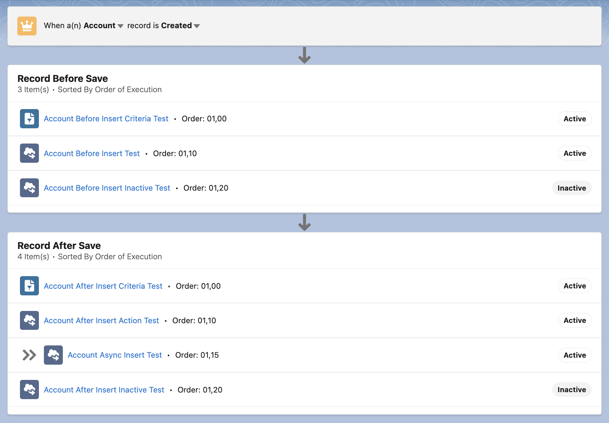

# Domain Process Bindings Explorer

This is a project that helps you easily visualize (and soon manage) your AT4DX Domain Process Binding Custom Metadata records through a Lightning Web Component.

# Contribution Guidelines

Any contributions are welcome! These can be in the form of Issues in our GitHub page or through Pull Requests.

If you're looking for ideas on something to work on feel free to [check out the Issues tab](https://github.com/Vacster/Domain-Process-Bindings-Explorer/issues).

For a Pull Request to be accepted, any new code must be tested (>85% coverage) and documented:

- In the case of Apex code it must follow [ApexDoc](https://github.com/SalesforceFoundation/ApexDoc)
- In the case of Javascript in Lightning Web Components it must follow [JSDoc](https://jsdoc.app/)

Lightning Web Components are tested using Jest with [@salesforce/sfdx-lwc-jest](https://github.com/salesforce/sfdx-lwc-jest)

# Dependencies

This project is built on top of [AT4DX](https://github.com/apex-enterprise-patterns/at4dx) and thus it has to be set up first.

[Follow this guide to easily set up AT4DX](https://github.com/apex-enterprise-patterns/at4dx/wiki/Environment-Setup)

# License

This project is distributed under BSD-3-Clause License, this is the same as AT4DX.

Copyright belongs to [Kamil Segebre](https://github.com/Vacster), all rights reserved.